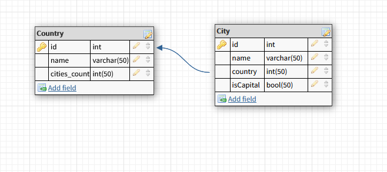
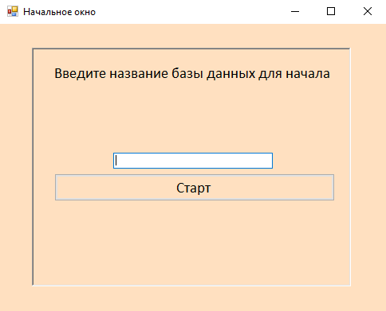
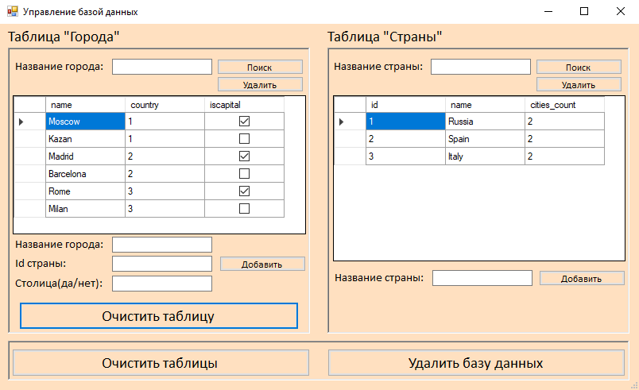

# Отчёт 

Лабораторная работа №2(4)  
Выполнили: Алексей и Илья Таценко    
Группа: ПИ-2   

---

### 1. Создание схемы бд.

В качестве предметной области были выбраны данные о странах и городах, находящихся в них. Таблица Country(Страна) содержит информацию о странах и состоит из трёх полей: id(индентификатор), генерирующийся автоматически, name(название страны) и cities_count(количество городов в данной стране). Таблица City содержит информацию о конкретном городе в стране и состоит их четырёх полей: id(идентификатор), генерирующийся автоматически, name(название города), country(страна) и isCapital(является столицей).

Схема БД: 



### 2. Реализация реляционной БД для выбранной предметной области.

Sql-код по созданию всех хранимых процедур и функций находится [здесь](https://github.com/Ilya-Tatsenko/GUI/tree/master/GUI/bin/Debug/SQL.txt).

### 3. Критерии к БД:
  
- БД должна быть в третьей нормальной форме или выше;

  Данная БД представлена в третьей нормальной форме, так как в каждой стране может находится несколько городов, но каждый город может находиться только в одной стране. 

- Минимальное количество таблиц – 2;

  В базе данных создано 2 таблицы: Country(Страна) и City(Город).

- Все подключения из GUI должны осуществляться выделенным, не root, пользователем;

  При создании новой базы создается пользователь sqladminи становится ее владельцем. Если такой пользователь уже есть, то ему назначаются соответствующие права на эту базу данных.

- Должен существовать как минимум один индекс, созданный вами по выбранному текстовому не ключевому полю;

  Создано 2 уникальных индекса по полю name(Название страны) в таблице Country и name(Название города) - в таблице City.

  ```sql
  CREATE UNIQUE INDEX idx_country ON country (name);
  CREATE UNIQUE INDEX idx_city ON city (name);
  ```

- В одной из таблиц должно присутствовать поле, заполняемое/изменяемое только триггером

  В таблице City было создано 2 триггера: на удаление существующих данных и на вставку новых. При этих операциях в поле cities_count в таблице Country записывается общее количество городов в этой стране (из таблицы City). 
  
  ```sql
  CREATE OR REPLACE FUNCTION function_count_insert() RETURNS TRIGGER AS
  $BODY$
  BEGIN
      update country set cities_count = (select count(id) from city where country = new.country) where id = new.country;
    return new;
  END;
  $BODY$
  language plpgsql;

  CREATE TRIGGER trig_count_insert
       AFTER INSERT ON city
       FOR EACH ROW
       EXECUTE PROCEDURE function_count_insert();


  CREATE OR REPLACE FUNCTION function_count_delete() RETURNS TRIGGER AS
  $BODY$
  BEGIN
      update country set cities_count = (select count(id) from city where country = old.country) where id = old.country;
    return new;
  END;
  $BODY$
  language plpgsql;

  CREATE TRIGGER trig_count_delete
       AFTER delete ON city
       FOR EACH ROW
       EXECUTE PROCEDURE function_count_delete();
  ```

### 4. Реализация программы GUI.

При создании базы вызывается код из файла SQL.txt. При взаимодействии с базой используются функции и хранимые процедуры.
 
 ### 5. Структура проекта.
 
 Основной файл - Program.cs. Он вызывает стартовое окно - Form1.cs. Окно редактирования базы данных - FormEdit.cs.
 
 ### 6. Вид приложения.
 
Начальное окно программы:



Окно редактирования базы данных:



### 7. Видео с демонстрацией работы приложения.

https://www.youtube.com/watch?v=C4ER3fRBPSs
